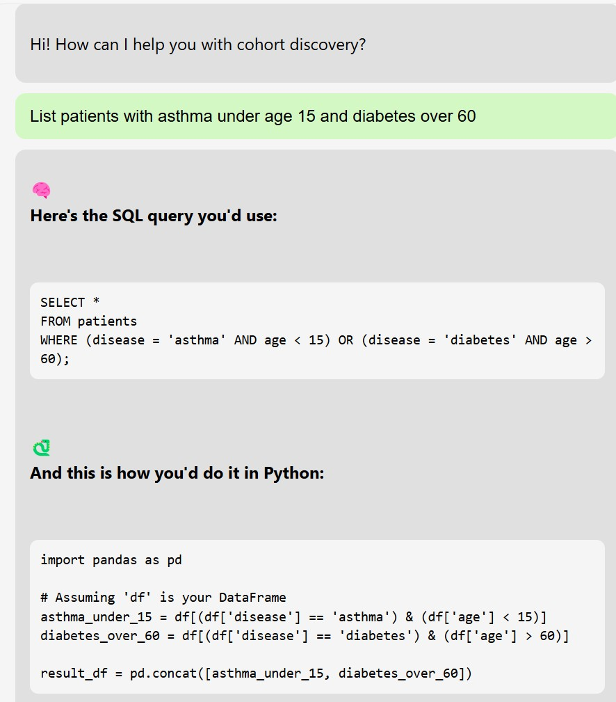

🧠 Cohort Discovery Chatbot

A smart, interactive prototype built as part of Google Summer of Code (GSoC) 2025 under the "Enhancing the Cohort Discovery Chatbot" project by Data for the Common Good.

This chatbot allows users to enter natural language queries like:

"Find patients under 10 with asthma or diabetes"

It intelligently generates:
- 🧠 SQL Queries
- 🐍 Python (Pandas) Code

These outputs can be used directly on datasets containing patient records.


🔧 Tech Stack Used

- Frontend: React + Vite
- API: Gemini 1.5 Pro (via Google AI Studio)
- Markdown Renderer: react-markdown
- Environment Variables: `.env` for API key management
- Styling: CSS (custom styling)


✨ Features

- Conversational interface for natural query input
- Generates SQL and Python queries based on age, condition, gender, visits, etc.
- Supports logical filters like AND, OR, and nested conditions
- Displays output in beautifully formatted Markdown with emojis for clarity


🚀 Getting Started

1. Clone the repo
```bash
git clone https://github.com/your-username/cohort-chatbot.git
cd cohort-chatbot
```

2. Install dependencies
```bash
npm install
```

3. Setup your `.env`
```bash
VITE_GEMINI_API_KEY=your_google_api_key_here
```
> You can get the API key from [Google AI Studio](https://aistudio.google.com/app/apikey)

4. Run the app
```bash
npm run dev
```
Visit: [http://localhost:5173](http://localhost:5173)


💬 Example Queries to Try

- Get patients under 10 with diabetes or asthma.
- Show patients over 60 who visited emergency in the last 90 days and have diabetes.
- Find female patients between 30 and 50 with hypertension.
- List patients with asthma under age 15 and diabetes over 60.
- Get patients between 30 and 50 who are taking Metformin or Insulin and have not been diagnosed with hypertension.
- Retrieve patients with multiple chronic conditions (e.g., diabetes, asthma) who are also on multiple medications.
- Get patients aged between 25 and 40, with asthma, who had more than one emergency visit in the last 60 days.

🧪 Example Response

Query: "List patients with asthma under age 15 and diabetes over 60"

Output:

[](public/Output.jpg)


🛠 Project Context: GSoC 2024

This project was developed as a prototype submission for:
- Organization: Data for the Common Good (PedsCommons)
- Project: [Enhancing the Cohort Discovery Chatbot](https://docs.pedscommons.org/GSoC/ideas)
- Goal: Improve natural language understanding, query generation, and user feedback mechanisms in chatbot systems for cohort exploration.


📁 Project Structure
```
├── src/
│   ├── App.jsx          # Main chatbot UI
│   ├── App.css          # Styling
│   ├── api.js           # Gemini API call logic
│   ├── data/            # (Optional) Placeholder data files
│   └── index.jsx        # App entry point
├── .env                 # Your Gemini API key
├── README.md            # You're reading it!
```

🤝 Contributions
This is a prototype project submitted for GSoC.

